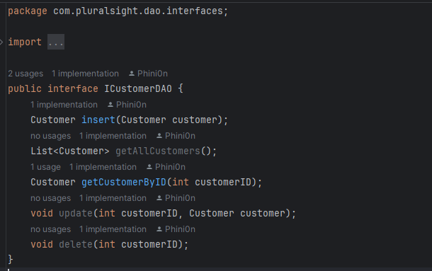

# Car Dealership

## Description of the Project

The Car Dealership program allows a user to manage a Car Dealership. Major objects of the dealership includes:
- Contracts
- Vehicles

Vehicle information is stored within the Car Dealership database with the attributes:
- VIN
- Year
- Make
- Model
- Vehicle Type
- Color
- Odometer
- Price

Contract information stores
- ContractID
- Date
- If the contract is sales or not
- Vehicle VIN
- CustomerID

Whenever a vehicle is added or removed, the information is updated within the dealership.csv file.

## User Stories
> - As a user I need to see the details of a vehicle, so I can see which vehicle I'd like to purchase.
> - As a user I need to be able to filter vehicles by price, so that I can buy the right vehicle for my budget.
> - As a user I need to be able to search by the make model, so that I can buy the right brand I trust.
> - As a user I need to be able to filter by a vehicle's year, so that I can know how old the vehicle is.
> - As a user I need to be able to see the color of cars available at the dealership, so that I can choose a color that aesthetically pleases me.
> - As a user I need to be able to see a vehicles mileage, so that I can judge how often the car has been used, and if that would depreciate the value of the car.
> - As a user I should be able to see the vehicles by their type, so that I can buy the right vehicle for my needs and/or family.
> - As a user I should be able to see all the vehicles available at the dealership, so that I can compare my needs against what's available.
> - As a dealership owner, I should be able to add new vehicles to the dealership program, so that users can see new vehicles are available.
> - As a dealership owner, I should be able to remove vehicles from the dealership program, so that users can see an accurate inventory.
> - As a user I should be able to see dealership information, so that I can contact the dealership to plan a purchase or visit.
> - As a dealership owner, I should be able to update the dealership with the correct added and removed vehicles, so that I can display an accurate inventory.
> - As a user, I should be able to purchase a vehicle contract and have it stored in a database, so that my information is in a concrete place.
> - As a dealership owner, I should be able to see all the Contract and Vehicle information in the dealership, so that I can make informed decisions on business ventures.

## Setup

Instructions on how to set up and run the project using IntelliJ IDEA.

### Prerequisites

- IntelliJ IDEA: Ensure you have IntelliJ IDEA installed, which you can download from [here](https://www.jetbrains.com/idea/download/).
- Java SDK: Make sure Java SDK is installed and configured in IntelliJ.
- MySQL or other SQL database.

### Use the schema files included to populate the database.

1. Open your file explorer.
2. Use a program like SQLWorkbench to open the schema files.
3. Run the `CarDealershipDatabase` first.
4. Run the `CarDealershiPopulate` second.

### Running the Application in IntelliJ

Follow these steps to get your application running within IntelliJ IDEA:

1. Open IntelliJ IDEA.
2. Select "Open" and navigate to the directory where you cloned or downloaded the project.
3. After the project opens, wait for IntelliJ to index the files and set up the project.
4. Find the `program` class with the `public static void main(String[] args)` method.
5. Right-click on the file and select 'Run 'YourMainClassName.main()'' to start the application.

## Technologies Used

- IntelliJ IDEA 2023.3.3 (Ultimate Edition)
- Java 17 (Amazon Corretto 17.0.12)
- MySQL Workbench

## Demo
### The Main Menu

## Unique Features:
- I added an extra customerDAO that made sense within the context of the program.

- ContractsDAO uses one DAO instead of two separate LeaseContractsDAO and SalesContractsDAO.
- Use of lombok to get practice with the dependency.

## Future Work

- Add DAOs for inventory and vehicles.

## Resources

- [Workbook 8](https://github.com/RayMaroun/yearup-fall-section-4-2024/blob/master/pluralsight/java-development/workbook-8/jdbc-crud/src/main/java/com/pluralsight/db/DataManager.java#L66)
- [Workbook 9](https://github.com/RayMaroun/yearup-fall-section-4-2024/blob/master/pluralsight/java-development/workbook-9/NorthwindTradersSpringBoot4/src/main/java/com/pluralsight/NorthwindTradersSpringBoot4/dao/impl/JdbcProductDao.java)
- [Lombok Documentation](https://projectlombok.org/features/)
## Thanks

Thank you to Raymond Maroun for continuous support and guidance.